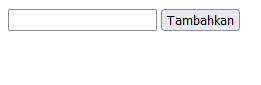
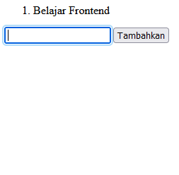
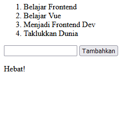

# Vue CLI

## Resume
Dalam materi ini, mempelajari tentang Vue CLI.

### Vue CLI
__Vue CLI__ (Command Line Interface) adalah perkakas standar untuk memudahkan pembuatan aplikasi vue baru.

__Webpack__ adalah sebuah metode blunder, digunakan untuk menggabungkan seluruh module project aplikasi berupa file Javascript, HTML, CSS, gambar dan lain-lain menjadi satu file (tipe yang sama).
Cara Kerja Vue CLI yaitu pasang vue CLI, inisiasi aplikasi dan jalankan aplikasi.

__Cara Kerja Vue CLI yaitu:__
1.	__Pasang vue CLI__, yaitu untuk memasang dengan menjalankan perintah “npm install -g @vue/cli” dan memastikan sudah terpasang menggunakan perintah “vue –version”.

2.	__Inisiasi aplikasi__, untuk membuat aplikasi baru dengan perintah “vue create <namaaplikasi>” “vue create .”.

3.	__Jalankan aplikasi__ , yang mana terdapat perintah yang tertulis di script di dalam package.json. Setelah selesai melakukan proses kompilasi dan tidak ada error, aka nada log informasi alamat aplikasi kita dapat diakses. Jika di dalam direktori aplikasi tidak terdapat node_modulse atau isinya tidak mutakhir, perlu melakkan perintah “npm install” baru bisa melakukan proses kompilasi tanpa error “npm run serve”.

__Perkakas Penting__
1.	Penyorot sintaks adalah perkakas untuk memberikan warna pada codingan kita sesuai dengan setelan/peraturan dari ekstensi berkas yang digunakan.
2.	Linter adalah alat yang memadai kode anda secara terperogram dengan tujuan menemukan masalah baru yang dapat menyebabkan bug atau ketidakkonsistenan dengan standar yang berlaku.
3.	Code formatter adalah perkakas untuk membantu menyeragamkan gaya code yang kita tulis. Dapat mengubah secara otomatis gaya kode yang kita tulis sesuai dengan pengaturan yang berlaku ketika menyimpan file.
4.	Git inspector adalah perkakas yang m;engetahui versi atau commit yang ada untuk setiap baris code. Perkakas ini membantu ketika kolaborasi dengan rekan tim.

### Vue Komponen File Tunggal
__ Komponen file tunggal__ memungkinkan kita membangun seluruh komponen (struktur, gaya, dan fungsi) dalam satu file. Sebagian besar editor kode menyedikan penyorotan sintaks dan linting. Komponen file tunggal memiliki ekstensi __.vue__

__Cara Kerja Komponen File Tunggal__
Terdapat 3 tag pada komponen file tunggal:
1.	Template, memuat dan merender HTML tag pada umumnya.
2.	Script, memuat sintaks javascript dan dapat menerima atribut lang yang biasanya untuk penggunaan typescript.
3.	Style, memuat sintaks CSS. Juga dapat menerima atribut lang yang biasanya untuk penggunaan CSS preprosesor seperti Stylus, SCSS. Atribut tambahan lainnya adalah scoped, yang berarti CSS hanya akan diterapkan di komponen ini saja.

### Vue Struktur Folder
Seiring berkembangnya aplikasi dan bertambah kompleksnya aplikasi, maka susunan direktori bisa berubah sesuai keinginan.

__Assets__ , di derektori ini kita akan menyimpan semua file asset. Seperti halnya menyimpan font, ikon, gambar, style, dll.

__Components__ , di dalam direktori ini kita akan menyimpan semua file komponen file tunggal vue.

__Router__, di dalam direktori ini kita dapat menyimpan semua file yag terikat dengan vue-router. Vue router adalah library untuk mengatur routing alamat aplikasi vue.

__Store__ adalah direktori penyimpanan vuex tempat kita dapat menyimpan semua file terkait vuex. Vuex adalah library untuk mengatur penyimpanan state berbasis global pada aplikasi vue.

__View__ , yang mana isinya mirip seperti direktori components yaitu komponen file tunggal namun yang membedakan adalah pada direktori ini digunakan sebagai halaman, di mana file langsung dengan router.       Sedangkan file di direktori components berhubungan langsung dengan file di direktori views atau sesame file di folder components.

__Test__ , direktori tests berada di luar direktori src karena direktori ini tidak berhubungan langsung dengan file yang dibutuhlan untuk proses pengembangan. Berisi berkas untuk melakukan unit testing komponen atau fungsi yang ada di dalam direktori src.

## Task
__Buatlah sebuah to do list dengan menggunakan komponen file tunggal__

### 1. Memiliki sebuah input dan sebuah tombol

### 2. Menunjukkan list to do yang telah ditambahkan dan reset (kosongkan) input setelah tombol diklik

### 3. Jika list yang sudah dilakukan sama dengan atau lebih besar dari 4 maka tunjukkan kata "Hebat!" di bawah input.
